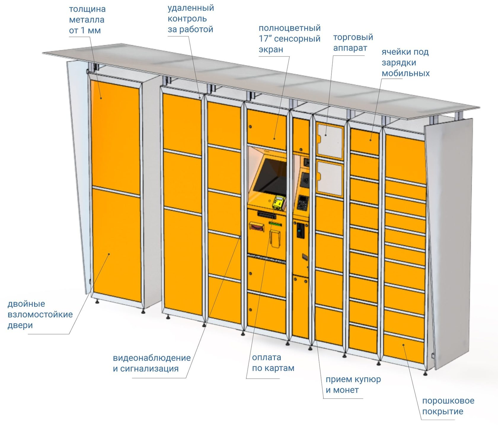
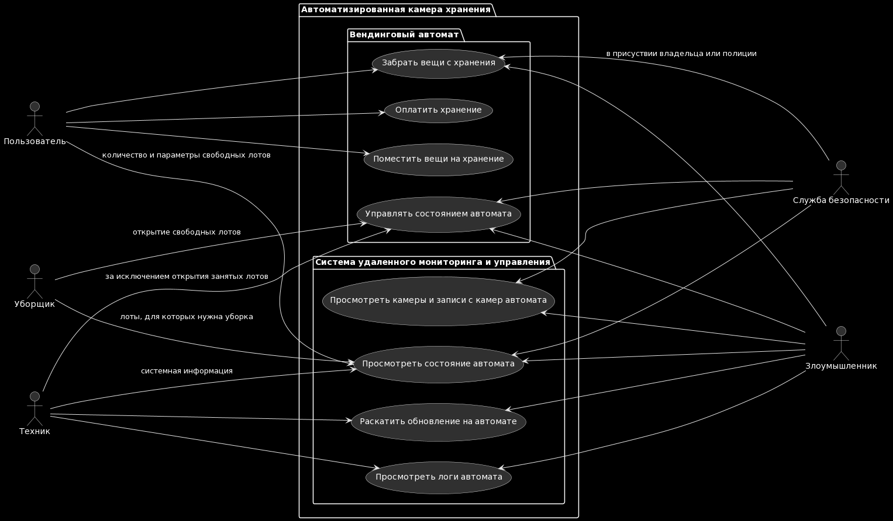

# Автоматизированная камеры хранения
## Краткое описание назначения и применения продукта

Камера хранения оказывает услуги по срочному хранению вещей. Автоматизированная система на базе вендингового автомата позволяет оказывать такую услугу 24/7 и без участия оператора. Такой автомат может быть установлен в любом общественном месте в помещении или на улице.

## Ценности продукта

Главный актив владельца такого автомата - его репутация. Если автомат плохо работает, позволяет без особого труда третьим лицам получить доступ к содержимому лотов или стал источником утечки персональной информации о клиентах, то никто не будет пользоваться таким продуктом, а денежные потоки в организацию иссякнут. Кроме того, за несоблюдение договора обслуживания или нарушение законодательства владелец может быть привлечен к ответственности.

Недопустимы:
- Доступ к лоту третьих лиц или владельцев автомата без присутствия владельца
- Повреждение содержимого лота
- Утечка персональных данных пользователя системы: биометрии, платежной информация, контактов для отправки QR, PIN-кода, записей с камер видеонаблюдения
- Доступ к наличке третьих лиц
- Долговременный сбой в работе автомата

Поэтому для системы можно выделить следующие ценности:
- Работоспособность системы по приему и выдаче содержимого лотов
- Конфиденциальность и целостность содержимого лотов
- Конфиденциальность персональных данных клиентов
- Целостность хранилища налички

## Верхнеуровневые сценарии работы продукта
### Основной пользовательский сценарий

Клиент авторизуется в системе с помощью отпечатка пальца, генерирует пин или QR код. Выбирает нужный лот для хранения. После помещения вещей в лот клиент закрывает его и система блокирует лот. Если пользователь выбрал PIN или QR код для авторизации, то по желанию он может быть распечатан.

### Другие сценарии использования системы

## Предложения и цели безопасности
## Предположения безопасности

1. Система может выходить из строя из-за апаратного или программного сбоя. При этом информация о сбое должна в онлайн режиме отображаться в мониторинге для оперативного реагирования.
2. Службы безопасности, уборки и технического сопровождения благонадежны, т.е. не используют служебное положение для доступа к содержимому лота или для распространения третьим лицам конфиденциальной информации.
3. Клиенты системы благонадежны, т.е. всеми имеющимися способами защищают выданные средства авторизации в систему камеры хранения.
4. Клиенты помещают на хранения вещи в соответствие с их условиями хранения.
5. Физический доступ к системе может позволить получить персональные (платежные данные клиентов (Наложение сканера карт на приемник для бесконтакной оплаты)

## Цели безопасности 

1. Информация о содержимом лота, равно как и доступ, недоступны для всех пользователей системы, за исключением владельца.
2. При извлечения с хранения содрежимое лота имеет то же состояние, что и на момент помещения в хранение.
3. Все межкомпонентные каналы защищены от неавторизованного просмотра и изменений.

## Архитектура

TBD